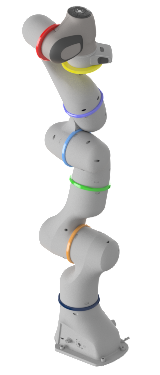

# Analytical Inverse Kinematics for the Franka Research 3 (MATLAB)

A fully analytical, geometric inverse kinematics (IK) solution for the 7-DOF lightweight
**Franka Research 3** robot (kinematically identical to the Franka Emika Panda),
implemented in MATLAB/Octave. The solution is non-iterative, deterministic, and reproduces
the forward kinematics across the entire workspace down to machine precision.

The implementation follows the geometric solver of **He & Liu (2021)**, is validated by a
round-trip against the official modified-DH forward kinematics, and is cross-checked against
an independent robot model (Peter Corke's Robotics Toolbox).

---

## Contents

<table width="100%">
<tr>
<td valign="top">

- [Overview](#overview)
- [Background](#background)
- [Method](#method)
- [Theory and equations](#theory-and-equations)
- [Kinematic model](#kinematic-model)
- [Repository structure](#repository-structure)
- [Requirements](#requirements)
- [Usage](#usage)
- [Frame handling: flange and tool/EE poses](#frame-handling-flange-and-toolee-poses)
- [Validation and results](#validation-and-results)
- [Implementation notes and pitfalls](#implementation-notes-and-pitfalls)
- [References](#references)
- [License](#license)
- [Acknowledgements](#acknowledgements)

</td>
<td valign="top" align="right">



</td>
</tr>
</table>

---

## Overview

The Franka is a redundant 7-axis robot: for a given end-effector pose there are infinitely
many joint configurations. This redundancy is resolved here through a single fixed parameter
— the last joint angle `q7`. With `q7` fixed, up to eight mathematical solutions exist
geometrically, four of which are physically reachable.

This repository contains:

- a **forward kinematics** in two conventions (modified DH and standard DH) for reference
  and cross-checking,
- a **consolidated single-solution solver** with case-consistent branch selection,
- an **enumerator** for all reachable solutions including a joint-limit filter,
- a **null-space analysis** showing how the joint angles move as `q7` is varied,
- a **validation script** that proves correctness via a round-trip (FK → IK → FK) over
  1000 random configurations, in both the flange and the tool/EE frame.

---

## Background

Analytical IK for the Franka is harder than for classic anthropomorphic 7-DOF arms (e.g. the
KUKA iiwa), because the robot has **linear offsets at the elbow and the wrist**. As a result,
the usual approaches — which exploit a "self-motion" about the shoulder-to-wrist axis — do not
apply, since Frame 6 necessarily translates when the last joint is moved.

He & Liu solve this by starting the computation at the end of the chain and choosing `q7` as
the redundancy parameter. The pose is then resolved geometrically through a chain of triangle
and intersection problems. The advantages over numerical solvers: a fixed number of
operations, a guaranteed solution (if one exists), no iteration or initial-guess risk, and
real-time safety.

---

## Method

The solution is computed in a fixed order:

1. **Fix `q7`** — redundancy parameter (target value or current value).
2. **`q4` (elbow)** — law of cosines in the shoulder–elbow–wrist triangle (O2–O4–O6),
   accounting for the elbow offsets.
3. **`q6` (wrist)** — two possible solutions, **case B1 / B2**.
4. **`q1`, `q2` (shoulder)** — two possible solutions, **case C1 / C2**.
5. **`q3`** — unique, from the orientation of Frame 2 and the O2–P–O6 plane.
6. **`q5`** — unique, from the projection into Frame 5.

This yields a theoretical 2³ = 8 solutions from the branches A (elbow), B (wrist) and
C (shoulder). The elbow case **A1 is mechanically blocked on the Franka** and — as in the
original paper — is deliberately not solved. Four reachable solutions remain: B1-C1, B1-C2,
B2-C1, B2-C2.

To avoid configuration "jumps" during continuous path control, the single-solution solver
picks the branch to match the current pose `qa` (see [Theory](#theory-and-equations)).

---

## Theory and equations

### Modified-DH transform (Craig convention)

Each link transform is built from its four DH parameters as:

```
        | cos θ           -sin θ            0          a       |
A_i  =  | sin θ·cos α      cos θ·cos α     -sin α     -d·sin α |
        | sin θ·sin α      cos θ·sin α      cos α      d·cos α |
        |   0                0               0          1       |
```

This is the **modified** (Craig) form used by the official Franka model — it differs from the
classic/standard DH matrix. Mixing the two is a common error (see
[pitfalls](#implementation-notes-and-pitfalls)).

The forward kinematics to the flange is the chained product:

```
T_flange = A1 · A2 · A3 · A4 · A5 · A6 · A7 · A_F
```

### Wrist position (flange frame)

The chain is solved backwards from the flange:

```
p7   = p_flange − dF·z_flange
x6   = R_flange · [cos(q7),  −sin(q7),  0]ᵀ
p6   = p7 − a7·x6
```

The IK core operates entirely in the **flange frame**. A tool / end-effector pose is reduced
to a flange pose by one fixed pre-transform before solving (see
[Frame handling](#frame-handling-flange-and-toolee-poses)).

### Elbow angle q4 (law of cosines)

```
O2O4 = √(d3² + a4²)                 O4O6 = √(d5² + a5²)
∠O2O4O3 = atan2(d3, a4)
∠HO4O6  = atan2(d5, |a5|)
∠O2O4O6 = acos( (O2O4² + O4O6² − O2O6²) / (2·O2O4·O4O6) )

q4 = ∠O2O4O3 + ∠HO4O6 + ∠O2O4O6 − 2π
```

### Wrist angle q6 (cases B1 / B2)

```
q6 = π − ψ6 − φ6        (case B1)
q6 =     ψ6 − φ6        (case B2)

case-consistent choice:  B1 if  dot(O2O6, x5(qa)) ≤ 0,  else B2
```

### Shoulder angles q1, q2 (cases C1 / C2)

With O2P the vector from the shoulder to the shoulder–elbow plane:

```
C1:  q1 = atan2( y2P,  x2P),   q2 =  acos(z2P / |O2P|)
C2:  q1 = atan2(−y2P, −x2P),   q2 = −acos(z2P / |O2P|)

case-consistent choice:  C1 if qa(2) ≥ 0,  else C2
```

`q3` and `q5` then follow uniquely from the elbow position and Frame-5 projection.

### Validation criterion

The solver is verified by a round-trip: for a sampled configuration `q`, compute `FK(q)`,
solve the IK, and run FK again. The residual

```
‖ FK(IK(FK(q))) − FK(q) ‖   →   machine precision
```

is checked for both position and orientation.

---

## Kinematic model

Modified Denavit–Hartenberg parameters from the official Franka documentation. The θ badges
are colour-matched to the joint rings in the rendering.

<table>
<tr>
<td valign="top">


</td>
<td valign="top">

| Frame | d [m] | θ | a [m] | α [rad] |
|---|---|---|---|---|
| Joint 1 | 0.333 |  | 0 | 0 |
| Joint 2 | 0 |  | 0 | −π/2 |
| Joint 3 | 0.316 |  | 0 | π/2 |
| Joint 4 | 0 |  | 0.0825 | π/2 |
| Joint 5 | 0.384 |  | −0.0825 | −π/2 |
| Joint 6 | 0 |  | 0 | π/2 |
| Joint 7 | 0 |  | 0.088 | π/2 |
| Flange (F) | 0.107 | 0 | 0 | 0 |
| End effector | 0.1034 | π/4 | 0 | 0 |

</td>
</tr>
</table>

### Frames at the end of the chain

- **Flange (F)** — the bare mounting plate: Frame 7 translated 0.107 m along the wrist axis z,
  with no extra rotation. This is the IK core's native frame.
- **End effector (EE)** — the official tool frame: a further 0.1034 m along z **and** a 45°
  (π/4) rotation about z. This fixed flange→EE transform corresponds to the robot's `F_T_EE`
  and is applied as a pre-transform, not inside the IK (see below). The 0.1034 m is the
  default; on the real robot `F_T_EE` is configurable.

### Joint limits (as used in the code)

| Joint | min [°] | max [°] |
|-------|---------|---------|
| q1    | −166    | 166     |
| q2    | −101    | 101     |
| q3    | −166    | 166     |
| q4    | −176    | −4      |
| q5    | −166    | 166     |
| q6    | −1      | 215     |
| q7    | −166    | 166     |

> Note: these limits correspond to the Franka Emika Panda. The Franka Research 3 shares the
> kinematic model but may have different joint limits — verify against the current official
> FR3 specification if needed.

---

## Repository structure

| File                          | Purpose |
|-------------------------------|---------|
| `forward_kinematics_modDH.m`  | Forward kinematics in **modified DH** (official Franka convention). Reference FK. |
| `forward_kinematics_stdDH.m`  | Forward kinematics in **standard DH** (shifted parameters). Produces identical poses; cross-check. |
| `IK_Franka.m`                 | **Main solver.** Returns one case-consistent solution. Accepts a flange pose, or a tool/EE pose (pre-transformed internally). |
| `IK_full.m`                   | Enumerator for all four reachable solutions (B1/B2 × C1/C2) including a joint-limit filter. |
| `IK_nullspace.m`              | Null-space motion: varies `q7` and plots q1–q6 and the validity of the pose. |
| `validate_IK.m`               | Round-trip validation (FK → IK → FK) over 1000 random configurations, flange and EE frame. |

---

## Requirements

- **MATLAB R2019b** or later, **or** GNU Octave.
- No additional toolboxes required — the scripts use base functions only.

---

## Usage

All scripts are configured by editing the input block at the top of the file and then running
the script.

### Forward kinematics

Enter the joint angles (in degrees) at the top of `forward_kinematics_modDH.m` and run it.

- **Input:** seven joint angles `q` [deg].
- **Output:** TCP position [mm] and orientation (roll-pitch-yaw, ZYX) printed to console.

`forward_kinematics_stdDH.m` is the independent cross-check in standard DH and prints the same
pose.

### Inverse kinematics — single solution (`IK_Franka.m`)

Set the input block:

```matlab
p_ee  = [-0.33938; 0.58864; 0.23309];        % TCP position [m]
roll  = deg2rad(-36.52);                      % orientation (ZYX Euler)
pitch = deg2rad( 83.16);
yaw   = deg2rad(100.05);
qa    = deg2rad([118.68; 35.20; 0.00; ...
                 -103.83; 158.32; 123.24; 10.00]);  % current pose / redundancy q7
frame_mode = 'flange';                        % 'flange' (default) or 'EE'
```

- **Output:** the seven joint angles of the case-consistent solution.
- `qa` is used twice: as the source of `q7 = qa(7)` and for the B/C branch selection, so the
  returned solution stays close to the current configuration.
- With `frame_mode = 'EE'`, the input pose is treated as a tool/EE pose and converted to a
  flange pose before solving (see below).

### All reachable solutions (`IK_full.m`)

- **Output:** a table of the four solutions with a validity flag per joint-limit check, plus
  the solution closest to the reference `qa`.

### Null-space analysis (`IK_nullspace.m`)

- **Output:** a figure with two panels — the evolution of q1–q6 as `q7` is swept
  (e.g. −120°…120°), and a validity band showing where the pose stays inside the hardware
  limits.

### Validation (`validate_IK.m`)

- **Output:** position and orientation error statistics (max / mean / median) over 1000
  random valid configurations, for both the flange and the tool/EE frame.

---

## Frame handling: flange and tool/EE poses

The IK core operates **only in the flange frame** — the frame the geometric derivation is
built on, and the one that is fully validated. Tool/end-effector offsets are removed *before*
solving, never baked into the IK.

The fixed flange→EE transform (the robot's `F_T_EE`) is:

```matlab
theta_ee = pi/4;     % official Franka EE rotation about z (DH table, theta_EE = pi/4)
dee      = 0.1034;   % default flange -> EE distance [m]
EE_offset = [cos(theta_ee), -sin(theta_ee), 0, 0;
             sin(theta_ee),  cos(theta_ee), 0, 0;
             0,              0,             1, dee;
             0,              0,             0, 1];
```

A tool/EE pose is converted to a flange pose by one pre-transform, then solved with the flange
IK:

```matlab
T_flange = T_EE / EE_offset;   % = T_EE * inv(EE_offset)
% ... then run the flange IK on T_flange
```

This design removes any sign ambiguity in the tool rotation, keeps a single validated IK path,
and lets you adapt to a real robot by simply replacing `EE_offset` with the actual `F_T_EE`
read from the controller.

---

## Validation and results

Round-trip FK → IK → FK over N = 1000 random valid configurations, in both frames. Both tests
are genuine, independent round-trips (the EE test uses the official `Rz(+π/4)` tool frame).

| Frame             | Configurations | Position error, max [m] |
|-------------------|----------------|-------------------------|
| Flange            | 1000 / 1000    | 1.475e-11               |
| Tool / EE (+π/4)  | 1000 / 1000    | 1.158e-11               |

The median position error is ~1e-16 (bit-exact reconstruction); the orientation error is
likewise at machine precision. The maximum (~1e-11 m) is pure floating-point accumulation,
about eight orders of magnitude below the robot's repeatability.

### Cross-validation against an independent model

The forward kinematics and the IK were additionally cross-checked against Peter Corke's
Robotics Toolbox Franka model (an independent, URDF-based implementation):

- FK vs. the toolbox flange frame (`panda_link8`), 200 random configs: max difference
  **4.5e-16 m**.
- The IK applied to the toolbox's poses and re-evaluated with the toolbox's own FK, 300
  random configs: max position error **6.5e-14 m** (median ~4e-16).

Matching the real, factory-calibrated robot would additionally require
a hardware check (read `(q, O_T_EE)` from the robot via libfranka and compare) — this is left
as future work.

---

## Implementation notes and pitfalls

These are the non-obvious points that cost the most time during development — documented so
others (and future me) don't repeat them.

- **Handle the tool/EE offset as a pre-transform, not inside the IK.** Baking a tool rotation
  into the wrist computation (e.g. via a `q7 ± π/4` trick) is error-prone and frame-sign
  dependent. Converting the EE pose to a flange pose up front (`T_flange = T_EE / EE_offset`)
  keeps one validated IK path and makes the tool frame trivially swappable for the robot's
  real `F_T_EE`.

- **Standard DH vs. modified DH.** The official Franka parameters are for the **modified**
  (Craig) convention. Plugging those same numbers into a **standard** DH transform produces a
  *different, wrong* robot. A standard-DH model needs its own, shifted parameter set. Always
  validate against a *correct* FK — a self-consistent but wrong FK will pass a round-trip while
  still not matching the real robot.

- **Validate honestly, avoid circular tests.** A round-trip only proves the IK inverts *that*
  FK. Make sure the FK used in validation is the real target frame (here: the official
  `Rz(+π/4)` EE frame), not one engineered to make the test pass.

- **Only the A2 elbow branch is solved.** Branch A1 ("elbow up") is mechanically blocked on the
  Franka, and the paper solves only A2. The genuine solution multiplicity comes from the wrist
  (B1/B2) and shoulder (C1/C2) branches.

- **The A1 "ghost solution" trap.** Naively enumerating A1 by flipping the sign of the
  elbow-triangle angle produces a `q4` far outside the joint range (≈ −310°) that does **not**
  reproduce the target pose. It is not a valid configuration — loop only over B and C.

- **Shoulder singularity (`q2 ≈ 0`).** With a stretched shoulder, `q1` and `q3` are not unique.
  Detect this case and take `q1` from the reference pose `qa`.

- **Numerical robustness.** Clamp all `acos`/`asin` arguments to [−1, 1]; floating-point drift
  can push them slightly outside the valid domain.

- **Orientation convention.** Inputs use ZYX Euler angles (roll-pitch-yaw). Make sure your pose
  source uses the same convention; when interfacing with a real robot, pass the rotation matrix
  directly rather than re-deriving Euler angles.

---

## References

This work is an independent MATLAB implementation of the method by He & Liu. Please cite the
original authors when using it.

**Primary basis:**

> Y. He and S. Liu, "Analytical Inverse Kinematics for Franka Emika Panda – a Geometrical
> Solver for 7-DOF Manipulators with Unconventional Design," in *2021 9th International
> Conference on Control, Mechatronics and Automation (ICCMA)*, IEEE, 2021, pp. 194–199.
> DOI: 10.1109/ICCMA54375.2021.9646185

```bibtex
@InProceedings{HeLiu2021,
  author    = {Yanhao He and Steven Liu},
  booktitle = {2021 9th International Conference on Control, Mechatronics and Automation (ICCMA)},
  title     = {Analytical Inverse Kinematics for {F}ranka {E}mika {P}anda -- a Geometrical Solver for 7-{DOF} Manipulators with Unconventional Design},
  year      = {2021},
  pages     = {194--199},
  publisher = {IEEE},
  doi       = {10.1109/ICCMA54375.2021.9646185}
}
```

Original C++ implementation by the authors: <https://github.com/ffall007/franka_analytical_ik>

**Kinematic parameters and joint limits:**

> Franka Emika GmbH, "Robot and interface specifications,"
> <https://frankaemika.github.io/docs/control_parameters.html>

---

## License

Released under the **MIT License** — free to use, modify, and distribute with attribution. Add
a `LICENSE` file to the repository. The underlying geometric method is by He & Liu; cite the
authors as shown above.

---

## Acknowledgements

The underlying geometric solution method is by Yanhao He and Steven Liu (Institute of Control
Systems, University of Kaiserslautern). This repository provides an independent MATLAB
implementation including forward kinematics, a solution enumerator, null-space analysis, and
numerical validation.
